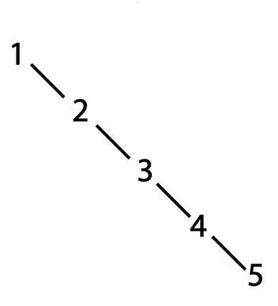

# Java-Data-Structures-QuizzApp
This was a class project created to explore and learn data structures
## The Task
Create An exam question bank using Java. 
* The application reads quizz data from text files. 
* The end user can select any given random number of questions from it. 
* The output is saved as another text file.  
* The app should store both multiple choice and true/false questions.
* The correct answer should also be stored.
* Justify your choice of data structure.
## Build and Run Instructions
The project was built using the netbeans IDE.  
The base project folder contains the following text files:
* multiple.txt (input file containing list of multiple choice questions)
* true_false.txt (input file containing list of true/false questions)
* Questions Output.txt (output file for random selection of questions)
### Running the application:
To run the application, open the project folder 'DSProject' in NetBeans and click the run button.
If you don't have NetBeans, the main method exists in the QuestionBank class.  
### Perform a query
1. Select the checkbox for either or both multiple choice or true/false questions. 
2. Enter how many questions you want in the adjacent textboxes.
3. Click the 'Generate Questions' button.
4. Output is shown in textarea below and automatically saved to 'Questions Output.txt'

### Additional info:
Data is read automatically when the application starts.  
The app will not break on bad user input or data read errors.  
There are 30 questions each for both types of questions.  
Every time a query is run, the content of the output file is overwritten.  
The output text file has been NOT added to .gitignore. This is so you can review the last output anytime.  
## Design 
Indexing and retrieval are the two main time complexity problems our data structure needs to solve in this project. To avoid the possibility of having duplicates in the output, we would also have to create an algorithm to retrieve a random set of non-duplicated questions from the data structure. 
### Data Structures and Algorithms
#### Binary Search Tree
We chose to use a Binary Search Tree. A BST has the following performance statistics, expressed in big O notation:
Algorithm | Average | Worst Case
------- | ------- | -------
Search | O(log n) | O(n)
Insert | O(log n) | O(n)
Delete | O(log n) | O(n)
You will notice that in our worst case scenario, the performance is not better than that of a linked list. This is because a BST requires insertion of data to be arbitrary or random instead of ordered. For example: consider if we wanted to add five questions numbered 1-5 into our BST using the question number as the means of determining which nodes are of greater or less value. Because each new number you insert into the tree is larger than the last, you will end up with a tree structure that looks like the following:

 
This structure is called a degenerate BST because there are no branches and does not benefit from the tree structure at all.
In attempting to resolve this issue, we could choose to use the question (String) as the means of determining which question has a greater or less value. When entering question objects into the BST, we could get a somewhat arbitrary insertion pattern (which is an improvement). However, there is a chance that we end up with an unbalanced BST that looks like the following:  

Given that we would have little control over how the data is stored in the tree, we could still end up with less than ideal performance time. Furthermore, using the question strings as the identifier can become an issue when inserting data into the tree. Consider the two following questions:  
>Which of the following statements is true?  
>a)	The capital of Port of Spain is Trinidad & Tobago  
>b)	The capital of Tobago is Port of Spain  
>c)	The capital of Spain is in Trinidad  
>d)	The capital of Trinidad & Tobago is Port of Spain 
   
>Which of the following statements is true?  
>a)	Java source code is compiled into a Java interpreter  
>b)	Java source code is compiled into a Byte Code  
>c)	Java source code is compiled native C  
>d)	Java source code is compiled into a Byte Compiler 

The above questions would cause an issue because the strings for the question are the same in both questions. When inserting data into a BST, we expect each node to be unique since lower value nodes are stored to the left and higher value nodes are stored to right. This issue can be solved a variety of ways, but the most optimal solution would be to use an integer to identify and differentiate between questions since it is faster to compare integers than strings.

### AVL Binary Search Tree
To resolve these issues and optimize our application, we implemented a special type of binary search tree called an AVL Binary Search Tree, named after inventors: Adelson-Velsky and Landis. This type of tree is similar to a regular BST except that during insertion, there is additional logic that is used to detect if the tree has become unbalanced and re-balance it accordingly.
This is achieved by modifying the insertion algorithm. Typically, a recursive function is used to traverse the tree and locate where a node should be attached. The AVL tree has additional logic that is performed after insertion when the algorithm is recursively traversing back up the tree to the root node. The basic algorithm is as follows:
1.	Start from the root
2.	Go left or right recursively until you reach where the new node should be inserted
3.	Insert new node (in a regular BST, the function stops here and each recursively called function exits)
4.	When you return to an ancestor node function, check to see if the tree is unbalanced (we use an integer value to determine this)
5.	If it is, we perform logic to swap nodes around such that the tree becomes balanced again.  

Note: documentation in the code explains the insertion method and supporting algorithms in full detail.  
With this setup, we have a guarantee that the tree structure will be either complete or near-complete and the BST will be balanced.  
  
The time complexity performance of an AVL tree can be express as follows:  
Algorithm | Average | Worst Case
------- | ------- | -------
Search | O(log n) | O(log n)
Insert | O(log n) | O(log n)
Delete | O(log n) | O(log n)

With this implementation, the worst case scenario has become the same as the average scenario.

### Random Selection Issue
At first we tackled this problem by generating a number between 1 and the total number of questions, then traversing the tree to find the question node with that number. Repetitions were handled by implementing a flag to mark nodes as already been selected. If a node was found and it was marked as already selected, then the algorithm would repeat until an unselected node was found. This seemed to work fine, however it gave us detrimental performance in certain situations.  
Consider the following scenario: there are 50 questions in the bank and the user requests 40. Every time you retrieve a question, you will mark that question as already been selected. Eventually you will reach a point where you are requesting the 26th question from the bank. At this point you will have a bank of questions that looks like the following:

Questions already selected | Questions available
------- | -------
25 (1/2 the total) | 25 (1/2 the total)

At this point, there is a 50/50 chance for you to retrieve either type of node. The more nodes you request from this point forward, the less likely it is for you to get a number for an unselected node.  
Furthermore, you will eventually come across a situation that looks like the following:
 
Questions already selected | Questions available
------- | -------
35  | 15 

At this point the algorithm will most likely have to perform a series of repetitions in order to finally get an unselected node.  
A solution to this issue could be implemented by storing values for already selected numbers into an array (using hashing for optimization) and using that to test if a random number has already been generated or not. This give us better performance because we do not have to traverse the BST to find a node and check to see if it is selected or not. However it still gives us an unpredictable algorithm (in time complexity) because we can still generate repeated numbers.
### Random Selection Solution
During experimentation with hashing we found an optimized solution to the problem that involves using an array, but without hashing.  
The algorithm is explained as follows:
1.	Store a value for the total number of questions in the bank. 
2.	Store a value called lastIndex which will be used track where the last index is in the array. This number starts at one less than the total number. (This should remind us of the array implementation of a queue)
3.	Create an array that stores all the numbers from 1 to the total number, For example, we will use 6 for total number and 5 as lastIndex.  
  Index- [0][1][2][3][4][5]  
  Value- [1][2][3][4][5][6]
4.	Get a random number between 0 and lastIndex.
5.	Prepare to return the value from that index
6.	Place the value from the lastIndex into the value of that index (If the random number is the same as lastIndex then we skip this step)
7.	 Decrease the value of lastIndex by one and return the value.
8.	Repeat from step 4 until you get the number of questions you need or the lastIndex becomes a negative value.

With this algorithm, we can implement a function that will give us a random number between 1 and the total number of questions in the bank. Every time you run this function, you will never get a repeated value.  
The algorithm for retrieving X number of questions randomly is as follows:
1.	Make sure X is in range 0 - total number of questions in bank.
2.	Initiate the previous algorithm. (steps 1-3)
3.	Get a random number.
4.	Find the question node in the BST with that number.
5.	Print the value of that question node.
6.	Repeat from step 2, X number of times.

This method of generating random numbers is superior to alternatives because it gives us a guarantee that the algorithm will run exactly X number of times for a request for X number of questions. If we had chosen to implement a hashing algorithm to store the random numbers generated, we would still be unsure how often the algorithm will have to repeat because of recurring values. 

## Conclusion
As always, there is room for improvement. Currently all requirements have been met. Further optimization could be done when reading data and saving data.